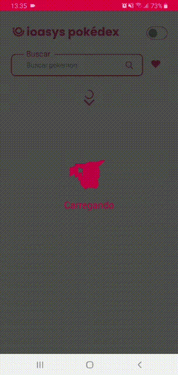

<div align="center" id="top"> 
  

&#xa0;

</div>

<h1 align="center">Pokedex</h1>

<p align="center">
  

  

  

  

</p>

Status

<h4 align="center">

	Pokedex 🚀 

</h4>
<p align="center">This is a small project make with react native for a challenge, in Pokedex you can find so many pokemons and read about their details, all data are retire from <a href="https://pokeapi.co/">PokeAPI</a> </p>

<hr>

<p align="center">
  <a href="#dart-about">About</a> &#xa0; | &#xa0; 
  <a href="#sparkles-features">Features</a> &#xa0; | &#xa0;
  <a href="#rocket-technologies">Technologies</a> &#xa0; | &#xa0;
  <a href="#white_check_mark-requirements">Requirements</a> &#xa0; | &#xa0;
  <a href="#checkered_flag-starting">Starting</a> &#xa0; | &#xa0;
  <a href="#memo-license">License</a> &#xa0; | &#xa0;
  <a href="https://github.com/KevinSYSousa" target="_blank">Author</a>
</p>

<br>

## :dart: About

Pokedex is a large list of pokemons, here you can find informations, details and stats, if you want to search a specific one the ways of you find something is by <span>NAME</span> or <span>ID</span>, you can use the top toggle to change the theme of application to night mode, here you can save 12 favorites pokemon's and a new feature is share this on social media with your friends.

## :sparkles: Features

:heavy_check_mark: Pokemon's list;\
:heavy_check_mark: Search bar;\
:heavy_check_mark: Pokemon's details;\
:heavy_check_mark: Night Mode;\
:heavy_check_mark: Favorites list;\
:heavy_check_mark: Share on social media;

## :rocket: Technologies

The following tools were used in this project:

- [Axios](https://axios-http.com/)
- [Redux.js](https://redux-toolkit.js.org/)
- [React Native](https://reactnative.dev/)
- [styled-components](https://styled-components.com/)

## :white_check_mark: Requirements

Before starting :checkered_flag:, you need to have [Git](https://git-scm.com) and [Node](https://nodejs.org/en/) installed.

## :checkered_flag: Starting

```bash
# Clone this project
$ git clone https://github.com/KevinSYSousa/pokedex

# Access
$ cd pokedex

# Install dependencies
$ yarn

# Run the project
$ yarn start

```

## :memo: License

This project is under license from MIT. For more details, see the [LICENSE](LICENSE.md) file.

Made with :heart: by <a href="https://github.com/KevinSYSousa" target="_blank">Kevin Sousa</a>

&#xa0;

<a href="#top">Back to top</a>
